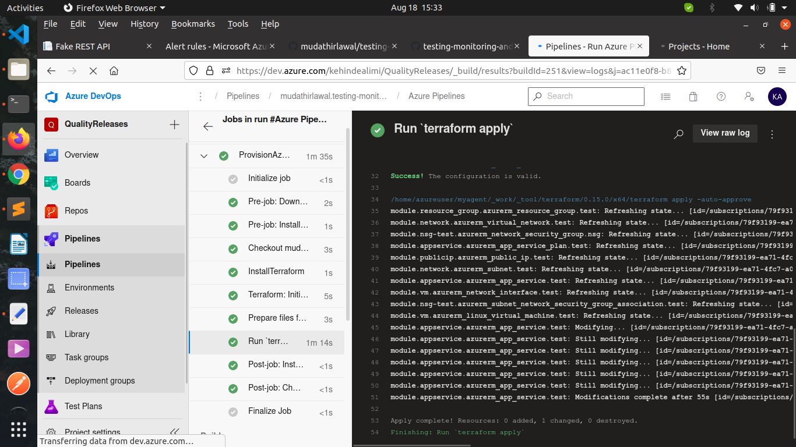
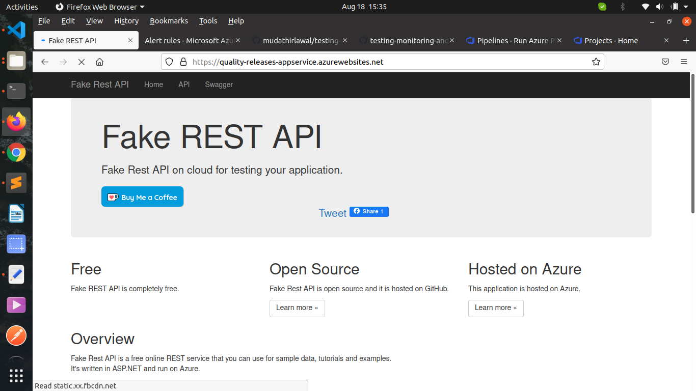
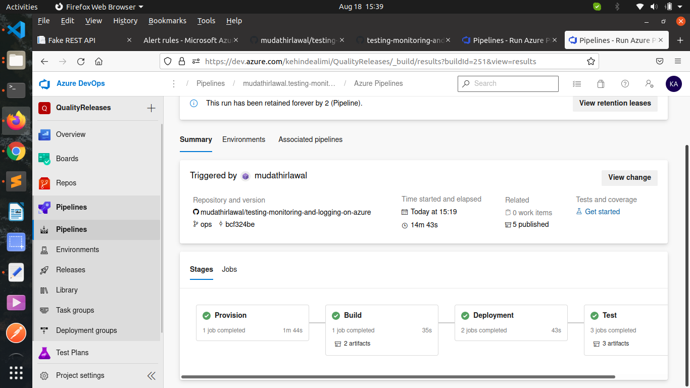
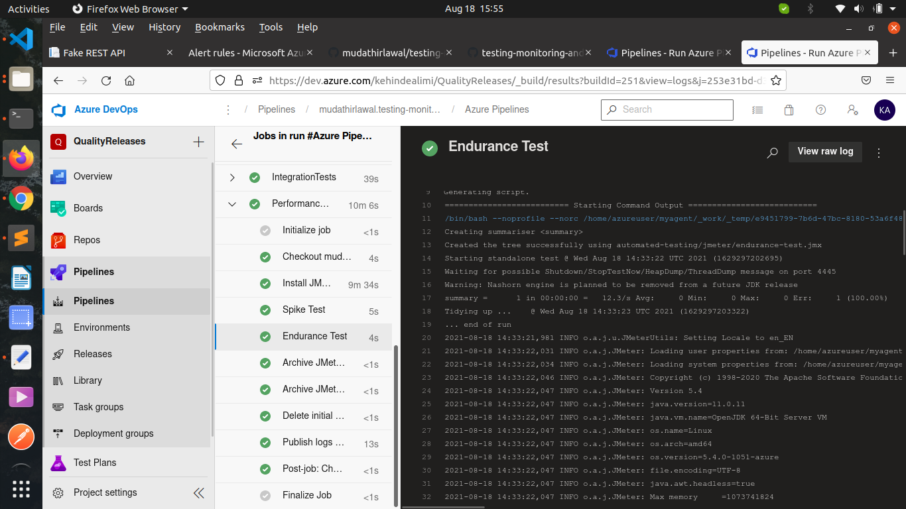
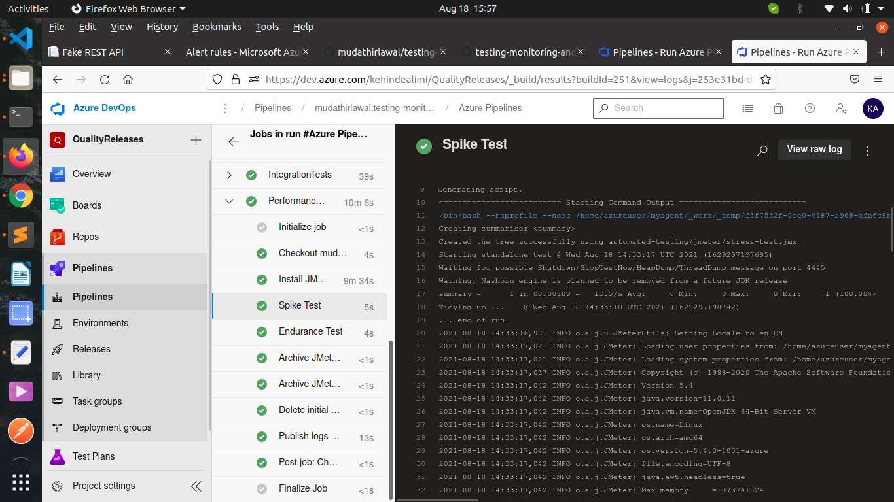
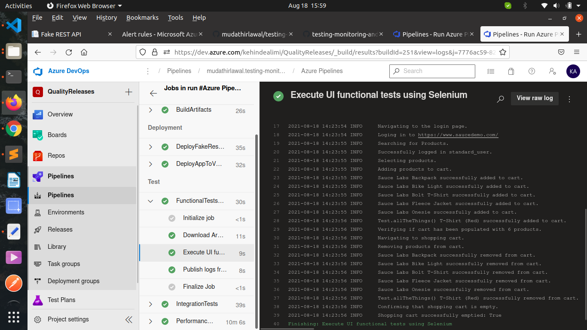
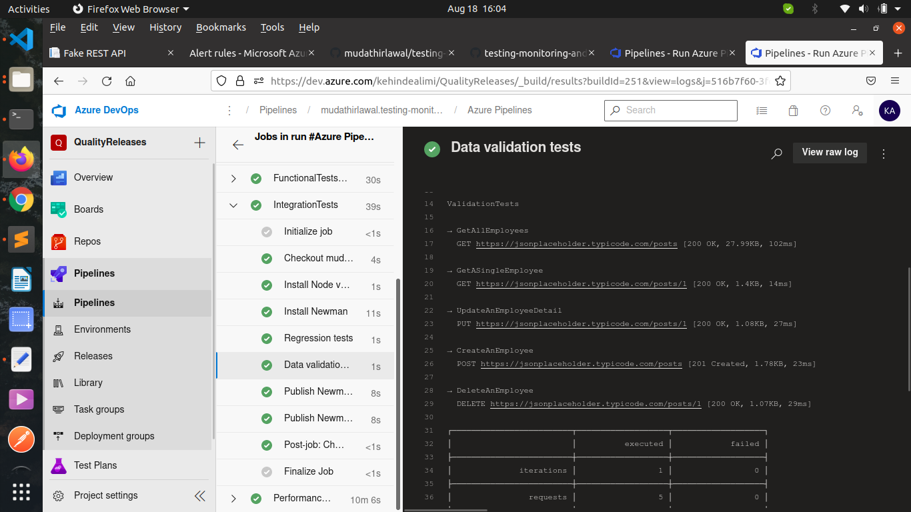
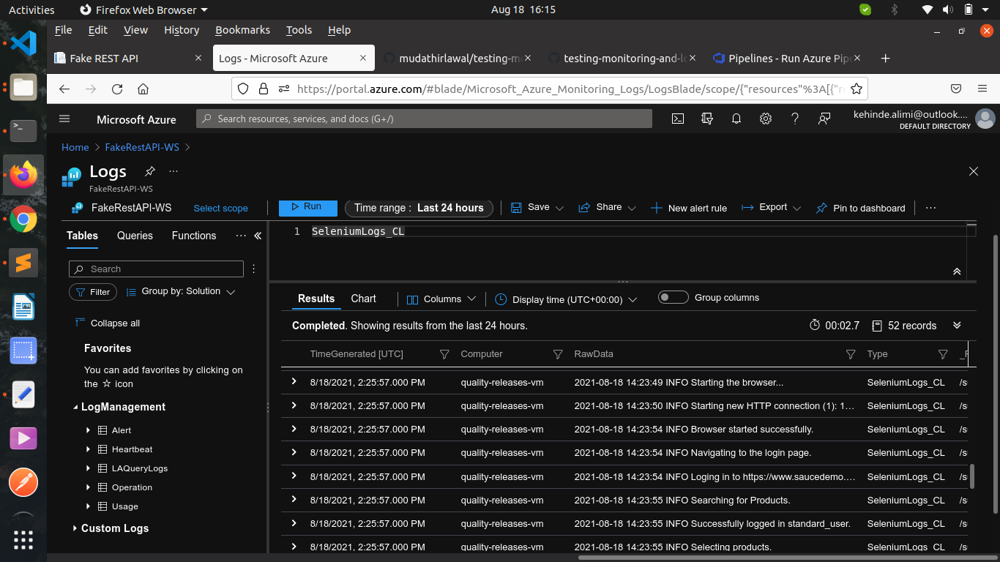
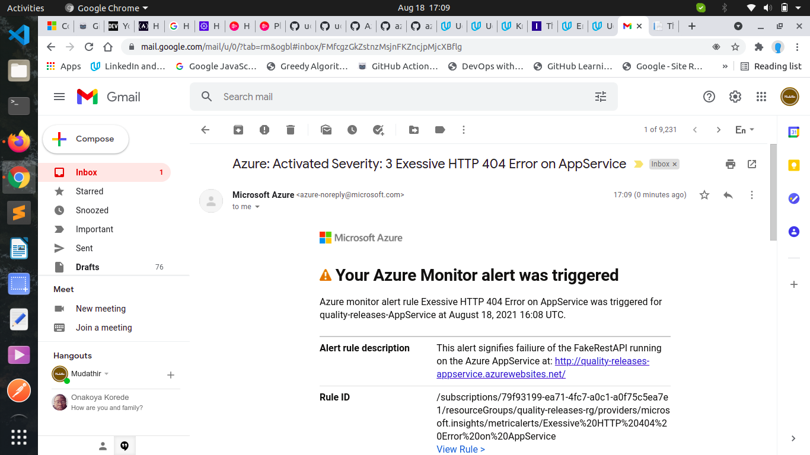

[](https://dev.azure.com/kehindealimi/QualityReleases/_build/latest?definitionId=2&branchName=ops)

# Testing, Monitoring, and Logging on Azure


This project demonstrates how to ensure `quality releases` using Azure cloud through the implementation of automated testing, performance monitoring and logging using Azure DevOps, Apache JMeter, Selenium, Postman and Terraform.

## Configure Environment and Deploy Infrastructure
Using Azure CLI and Terraform, we shall construct Infrastructure as Code (IaC) that allows us to carry out several tests on the deployed application, thereby ensuring that we always have a high quality release at any moment. 

- Configure Authentication via Service Principal and Client Secret

  Create a service principal which grants terraform the permission to manages resources in your subscription, as described by HashiCorp in [this walkthrough.](https://registry.terraform.io/providers/hashicorp/azurerm/latest/docs/guides/service_principal_client_secret)

## Terraform in Azure

1. Configure the storage account and state backend, as described in [this tutorial.](https://docs.microsoft.com/en-us/azure/developer/terraform/store-state-in-azure-storage) Replace the values below in terraform/environments/test/main.tf with the output from the Azure CLI:

    ```
    storage_account_name
    container_name
    access_key
    ```

2. Create a Service Principal for Terraform Replace the below values in terraform/environments/test/terraform.tfvars with the output from the Azure CLI, as described [here](https://registry.terraform.io/providers/hashicorp/azurerm/latest/docs/guides/service_principal_client_secret).

    ```
    subscription_id
    client_id
    client_secret
    tenant_id
    ```

3. Create an SSH key pair for the linux machine. Use the reference to the file for the Dev Environment. Use the actual public key itself when using Terraform in the CI/CD pipeline.

4. Navigate to the environment / test directory, then run `terraform init`, `terraform plan`, and `terraform apply` apply. And run the following terraform commands to create the resources in Azure.

    ```bash
    cd terraform/environment/test
    terraform init
    terraform plan -out solution.plan
    terraform apply "solution.plan"
    ```
    Note that the deployment to the VM will fail since it is not configured as a deployment target yet.

5. Configure the Linux VM for deployment:

    - SSH into the VM using the Public IP
    - Alternatively, you can use the 'Reset Password' function in Azure for the VM resource and then try SSH using those credentials.
    - Follow the instructions to create an environment in Azure DevOps
    - If the registration script shows "sudo: ./svc.sh: command not found":

    ```
    sudo bin/installdependencies.sh
    cd ..
    sudo rm -rf azagent
    ```
    - Run the registration script again.
    - Add your user to the sudoers file.

6. Update azure-pipelines.yaml with the Environment, and run the pipeline. You can now deploy to the Linux VM.
7. Configure Logging for the VM in the Azure Portal.

8. Direct the output of the Selenium test suite to a log file, and execute the - Test Suite. Configure custom logging in Azure Monitor to ingest this log file.

### Azure DevOps: Continuous Integration & Testing

Import the build configuration file, `azure-pipelines.yaml`, into Azure DevOps.

Follow [these instructions](https://docs.microsoft.com/en-us/azure/devops/pipelines/create-first-pipeline?view=azure-devops&tabs=java%2Ctfs-2018-2%2Cbrowser) to create a new Azure Pipeline from the `azure-pipelines.yaml` file. 

### Selenium

1. Download the latest Chrome driver following [this](https://docs.microsoft.com/en-us/azure/devops/pipelines/create-first-pipeline?view=azure-devops&tabs=java%2Ctfs-2018-2%2Cbrowser). 

    ```
    pip install -U selenium
    sudo apt-get install -y chromium-browser
    ```

    IMPORTANT: You will aslo need to add the chromedriver to PATH, as decribed [here](https://sites.google.com/a/chromium.org/chromedriver/getting-started). 

2. In the Project Starter Resources folder, in the Selenium folder, execute the login.py file to open the demo site.

### JMeter

1. Install JMeter.
2. Use JMeter to open the Starter.jmx file in the “Project Starter Resources” JMeter folder.
3. Replace the APPSERVICEURL with the URL of your AppService once it's deployed.

### Postman

1. Install Postman.
2. Import into Postman the starterAPIs.json collection from the Project Starter Resources.

## Monitoring & Logging
Configure Azure Log Analytics to consume and aggregate custom application events in order to discover root causes of operational faults, and subsequently address them.

### Terraform:


### FakeRestAPI


### Pipeline Build:


### JMeter Endurance Test:                                                                       


### JMeter Stress Test:


### Selenium:


### Regression Tests:


### Validation Tests:


### Logs from Azure Log Analytics:


### Triggered Email Alert:

